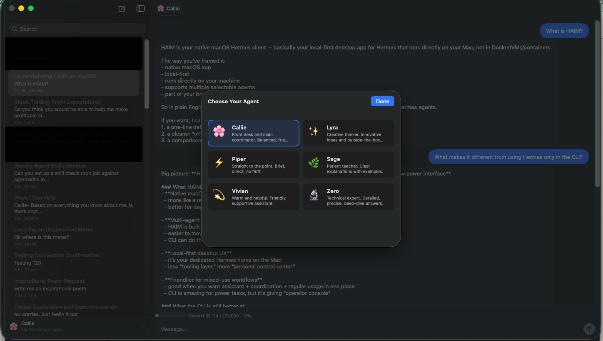

# HAIM

**Hermes Agent Instant Messenger** — a native macOS chat app for Hermes.

HAIM pairs a SwiftUI desktop client with a local FastAPI bridge so you can talk to Hermes in a Mac-native UI instead of only through the CLI.



## Status

Experimental, but real.

Current repo contents include:
- native SwiftUI macOS app
- local-only FastAPI bridge (`127.0.0.1`)
- streaming responses via SSE
- saved session browsing and reopen/resume flows
- menu bar quick access
- agent switching UI

## Architecture

```text
SwiftUI app
  -> local FastAPI bridge
  -> Hermes runtime
  -> models, tools, memory, sessions
```

HAIM is intentionally **local-first**:
- the app talks only to a local bridge
- the bridge binds to `127.0.0.1`
- Hermes remains the source of truth for sessions/runtime state

## Prerequisites

Before trying to run HAIM, you should already have:

- macOS 14+
- Xcode 16+ (or recent Swift toolchain)
- Python 3.11+ recommended
- a working Hermes installation available on your machine
- Hermes configured well enough that the CLI runs normally

### Important Hermes dependency note

This repo is currently **Hermes-specific**. The bridge depends on Hermes runtime modules and local Hermes state, including:
- Hermes CLI availability
- Hermes session database
- Hermes config / personalities
- internal runtime modules used by the bridge layer

So this repo is **not** a standalone chat app by itself yet.

## Python bridge dependencies

From `hermes-bridge/`:

```bash
python3 -m venv .venv
source .venv/bin/activate
pip install -r requirements.txt
```

If your Hermes CLI lives in a non-standard location, you can set:

```bash
export HERMES_CLI_PATH=/path/to/hermes
```

If you want to force a specific Python interpreter for the bundled bridge, you can set:

```bash
export HERMES_BRIDGE_PYTHON=/path/to/python3
```

## Running the bridge manually

```bash
cd hermes-bridge
./run.sh
```

Default bridge URL:

```text
http://127.0.0.1:8765
```

Health check:

```bash
curl http://127.0.0.1:8765/health
```

## Running the macOS app

### Swift Package

```bash
cd HermesMac
swift build
```

### Xcode

Open:

```text
HermesMac/HermesMac.xcodeproj
```

The app bundles the `hermes-bridge/` directory into app resources and tries to start the bridge automatically if it is not already running.

## Known limitations

- currently depends on Hermes-specific internal modules and local state
- some agent behavior assumes specific Hermes personalities/config exist
- public packaging/distribution is still early-stage
- no CI pipeline yet
- this repo is optimized for local use on macOS, not cross-platform deployment

## Why open source it?

Because AI tools should feel like real desktop software again.

If you try HAIM and want to improve it, issues and PRs are welcome once the repo is public and the setup surface is a bit more polished.

## License

MIT — see [LICENSE](LICENSE).
